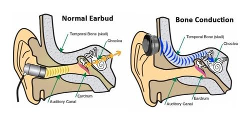

# FAQ sobre Auriculares de Conducción Ósea

## ¿Qué son los auriculares de conducción ósea?
Los auriculares de conducción ósea son una alternativa a los auriculares tradicionales, como los in-ear y de casco. Se colocan sobre el arco cigomático del cráneo y transmiten el sonido a través de los huesos hasta el oído interno, dejando el canal auditivo libre.

## ¿Cuáles son los beneficios de los auriculares de conducción ósea?

### Permiten la percepción del entorno
- **Seguridad**: Al no bloquear el canal auditivo, los usuarios pueden escuchar los sonidos del entorno mientras usan los auriculares, lo que es útil para actividades como caminar por la calle o hacer ejercicio en lugares donde la conciencia del entorno es crucial.

### Comodidad
- **Uso prolongado**: No se insertan en el oído ni se colocan sobre él, lo que reduce la incomodidad durante largas sesiones de uso. Son ideales para actividades deportivas o sesiones de trabajo prolongadas.

### Impacto en la salud auditiva
- **Sin efectos secundarios significativos**: Según la información disponible, no presentan más riesgos para la salud auditiva que los auriculares tradicionales, siempre y cuando se usen de manera responsable con niveles de volumen adecuados.

### Utilidad específica
- **Uso en bicicleta**: Aunque en algunos lugares, como España, está prohibido usar cualquier tipo de auricular mientras se conduce una bicicleta, los auriculares de conducción ósea permiten estar al tanto del entorno. Sin embargo, es crucial verificar la legislación local antes de usarlos en estas circunstancias.

## ¿Tienen alguna desventaja los auriculares de conducción ósea?
Sí, una de las desventajas es que la calidad de sonido no es equivalente a la de unos auriculares tradicionales. Además, debido a que dejan el canal auditivo libre, son susceptibles al ruido ambiental y el sonido que emiten puede ser escuchado por personas cercanas.

## ¿Son seguros para la salud auditiva?
No presentan más riesgos para la salud auditiva que los auriculares tradicionales, siempre que se usen de manera responsable y con niveles de volumen adecuados.

## ¿Puedo usar auriculares de conducción ósea mientras conduzco una bicicleta?
En algunos lugares, como España, está prohibido usar cualquier tipo de auricular mientras se conduce una bicicleta. Aunque los auriculares de conducción ósea permiten escuchar el entorno, es importante verificar la legislación local antes de usarlos en estas circunstancias.

## Resumen
Los auriculares de conducción ósea son una alternativa atractiva a los auriculares tradicionales, ofreciendo ventajas en términos de seguridad y comodidad, especialmente para actividades al aire libre. No obstante, es importante usarlos de manera responsable y estar al tanto de las regulaciones locales respecto a su uso en actividades específicas como el ciclismo.
